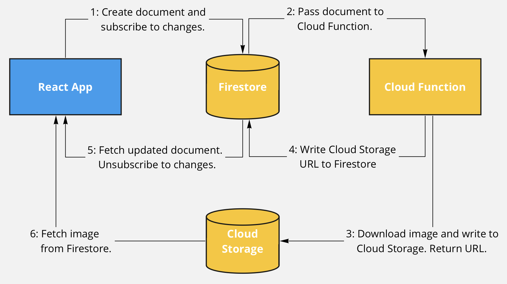

# firebase-async-test

A simple project testing out a event driven Firebase architecture.

## Overview

## Repository disposition

### [./app](app)

React app that visualizes the data and initiates the test by inserting new documents into Firestore.

### [./firebase](firebase)

Firebase project that handles image fetch requests using Firestore, Cloud Storage and a Cloud Function.

## Method

1. The client
   1. Adds a document with an image URL to Firestore.
   1. Subscribes to updates for the new document.
1. The new document triggers a Cloud Function
   1. Downloading the image from the document URL to Cloud Storage.
   1. Inserts the Cloud Storage URL to the newly created document.
1. The client
   1. Receives the new version of the document.
   1. Fetches the image from Cloud Storage and displays it in the app.
   1. Unsubscribes to future changes in the document.

## Out of scope

- Access rules
- Retries
